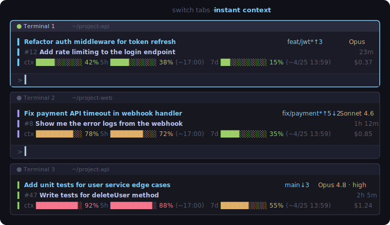
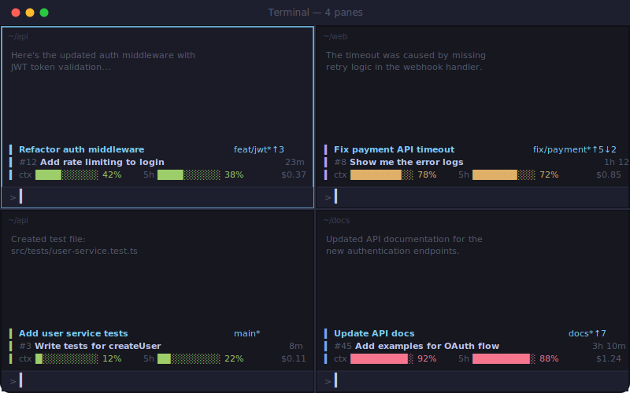

# claude-recall

[English](README.md)

Claude Code를 터미널 여러 개에서 동시에 돌리다 보면, 탭을 전환할 때마다 **"여기서 뭐 하고 있었지?"** 하는 순간이 옵니다.

claude-recall은 모든 Claude Code 세션의 맥락을 자동으로 추적해서, 전환하는 즉시 다시 집중할 수 있게 해줍니다.

<p align="center">
  
</p>

화면 분할에서도 잘 동작합니다:

<p align="center">
  
</p>

프롬프트 입력창 위에 항상 표시되는 2줄 HUD:

| 요소 | 설명 | 출처 |
|------|------|------|
| **purpose** | 세션 목적 — 첫 프롬프트에서 자동 감지, 또는 `/purpose`로 수동 설정 | claude-recall |
| **branch** | 현재 git branch | claude-recall |
| **elapsed** | 마지막 활동 이후 경과 시간 | claude-recall |
| **model** | 사용 중인 Claude 모델 (예: Opus 4.6) | Claude Code 빌트인 |
| **context%** | 컨텍스트 윈도우 사용량 | Claude Code 빌트인 |
| **cost** | 누적 세션 비용 | Claude Code 빌트인 |
| **last prompt** | 마지막으로 입력한 프롬프트 (2줄째) | claude-recall |

## 주요 기능

- **자동 추적** — 설치만 하면 끝. 세션 시작, 프롬프트 입력, 세션 종료를 자동으로 기록
- **Auto-purpose** — 첫 프롬프트에서 세션 목적을 자동으로 잡아줌
- **빌트인 메트릭 통합** — Claude Code가 제공하는 모델, 컨텍스트%, 비용 정보를 함께 표시
- **전체 세션 조회** — `/list`로 모든 세션 상태를 한 테이블에서 확인

```
 PURPOSE                          BRANCH        #  STATUS     ELAPSED
 Refactor auth middleware         feat/jwt      7  active     1h 23m
 결제 API 버그 수정                 fix/payment   3  active     45m
 테스트 커버리지 개선                main          2  completed  2d 5h
```

## 설치

```bash
# 1. 마켓플레이스 등록
/plugin marketplace add dkstm95/claude-recall

# 2. 플러그인 설치
/plugin install claude-recall@claude-recall

# 3. statusline 설정
/setup
```

설정 후 **Claude Code를 재시작**하면 statusline이 활성화됩니다.

## 사용법

설치 후에는 **자동으로 동작**합니다. 추가로 쓸 수 있는 명령어:

| 명령어 | 설명 |
|--------|------|
| `/purpose <텍스트>` | 세션 목적을 수동으로 설정 (자동 감지보다 우선) |
| `/list` | 추적 중인 모든 세션 조회 |
| `/setup` | statusline 재설정 / 설치 상태 확인 |

## 제거

```bash
# 1. 플러그인 제거
/plugin uninstall claude-recall@claude-recall

# 2. ~/.claude/settings.json 에서 "statusLine" 키 삭제 후 Claude Code 재시작

# 3. (선택) 세션 데이터 삭제
rm -rf ~/.claude/claude-recall/
```

<details>
<summary><strong>동작 방식</strong></summary>

**프롬프트를 입력할 때마다:**
→ 세션 목적, branch, 마지막 프롬프트를 자동 기록

**Claude가 응답할 때마다:**
→ 저장된 정보 + 모델/비용을 합쳐서 2줄 HUD로 표시 (100ms 이내)

**`/list` 실행 시:**
→ 모든 세션 파일을 스캔해서 활성/비활성/완료 상태를 테이블로 출력

모든 상태는 `~/.claude/claude-recall/sessions/`에 JSON 파일로 저장됩니다 — 세션당 하나, 플러그인 설치 경로와 분리.

</details>

<details>
<summary><strong>개발</strong></summary>

```bash
git clone https://github.com/dkstm95/claude-recall.git
cd claude-recall
npm install
npm run build
```

로컬 테스트:

```bash
claude --plugin-dir /path/to/claude-recall
```

</details>
