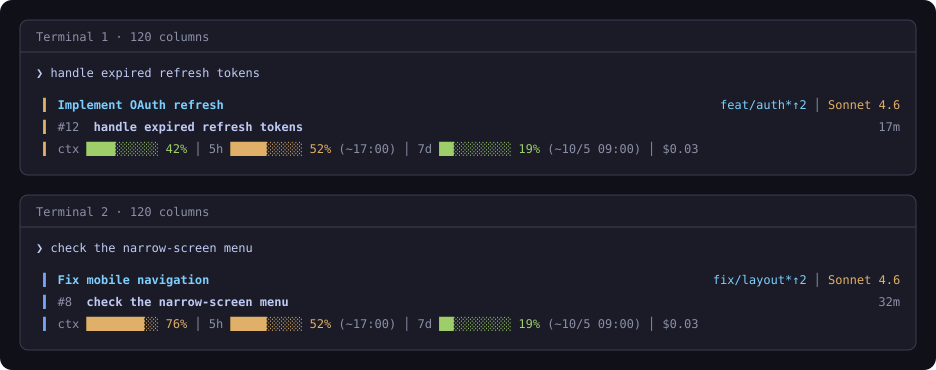
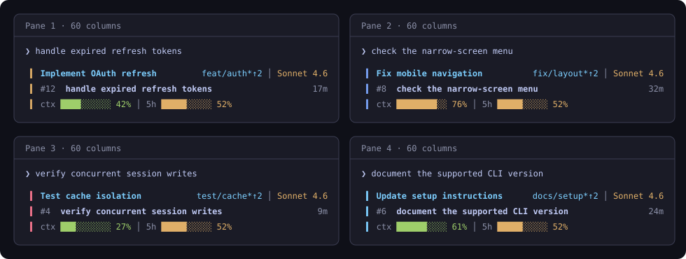

<h1 align="center">claude-recall</h1>

<p align="center">
  <em>병렬 Claude Code 세션을 위한 statusline — 각 세션이 뭘 하려고 시작했는지 한눈에.</em>
</p>

<p align="center">
  
  
  
  
</p>

<p align="center">
  <a href="README.md">English</a>
</p>

---

Claude Code를 터미널 여러 개에서 동시에 돌리다 보면, 탭을 전환할 때마다 **"여기서 뭐 하고 있었지?"** 하는 순간이 옵니다.

claude-recall은 모든 세션에 대해 두 가지 질문을 한눈에 답합니다:

1. **이 세션이 뭘 하려고 시작했는지?** — AI가 백그라운드에서 자율 관리하는 focus 라벨
2. **어디까지 왔는지?** — 턴 수, 경과 시간, 컨텍스트 사용량, git 상태, rate-limit 바

<p align="center">
  
</p>

<details>
<summary><strong>분할 패널(split-pane) 레이아웃에서 보기</strong></summary>

<p align="center">
  
</p>

</details>

## 왜 claude-recall인가?

- **Focus 자율 관리** — 실행할 커맨드 없음. Haiku 서브프로세스가 백그라운드에서 각 세션의 focus를 대화 언어 그대로 갱신.
- **디렉토리+브랜치 기반 accent color** — 현재 `cwd + 브랜치` 조합의 결정적 색상 바. 텍스트 읽기 전에 색상으로 세션 구분. 브랜치를 바꾸거나 Claude Code의 `/cd`로 세션 위치를 옮기면 색도 함께 갱신됩니다.
- **최신 Claude 메타데이터** — model 슬롯이 실제 모델 버전, effort 레벨, thinking 상태를 함께 표시할 수 있습니다. 선택 슬롯으로 세션 이름, agent, PR, worktree도 표시 가능.

추가로: git 상태 (dirty + `origin/<default>` 대비 앞섬/뒤처짐), rate-limit 바 (5h / 7d), Claude Code의 context / cost / model 메타데이터 — 최대 3줄 안에서 전부.

## 설치

**Node.js 20+**, **native Claude Code 2.1.286+**가 필요합니다. setup은 설정을 변경하기 전에 Claude 버전을 확인합니다.

> [!IMPORTANT]
> **백그라운드 LLM 호출 안내.** claude-recall은 각 세션의 focus를 Claude Haiku로 백그라운드에서 자동 갱신합니다. 이것이 플러그인의 핵심 기능이며 비활성화 토글은 없습니다. 백그라운드 LLM 호출을 원하지 않으시면 **설치하지 마세요**.

```bash
# 1. 마켓플레이스 등록
/plugin marketplace add dkstm95/claude-recall

# 2. 플러그인 설치
/plugin install claude-recall@claude-recall

# 3. 설치된 플러그인 커맨드 다시 로드
/reload-plugins

# 4. statusline 설정
/claude-recall:setup
```

> [!IMPORTANT]
> `/claude-recall:setup` 후 statusline 설정은 자동으로 다시 로드됩니다. 변경된 훅은 `/reload-plugins`로 적용하고, 기존 세션이 이전 launcher를 계속 사용하는 경우에만 재시작하세요.

> [!TIP]
> setup은 PATH를 자동 탐색하지 않습니다. 공식 native launcher(`~/.local/bin/claude`, Windows는 `%USERPROFILE%\.local\bin\claude.exe`)는 직접 감지합니다. Homebrew 등 다른 패키지 관리자를 쓴다면 stable launcher의 절대 경로를 확인한 뒤 명시적으로 전달하세요. 예: `/claude-recall:setup /opt/homebrew/bin/claude`.

> [!NOTE]
> **6.5.0으로 업그레이드:** `/reload-plugins` 다음 `/claude-recall:setup`을 한 번 실행해 설치된 launcher를 교체하세요. 훅은 세션별로 실제 로드된 플러그인 경로를 기록하므로 `--plugin-dir` 우선순위와 `/cd` 이동을 반영합니다. 첫 훅 실행 전에는 명시적인 개발 경로나 현재 프로젝트의 설치 레지스트리를 사용합니다.

## 사용법

설치 후에는 **자동으로 동작**합니다. focus 관리 관련 커맨드는 없습니다.

| 명령어 | 설명 |
|--------|------|
| `/claude-recall:setup` | statusline 재설정 / 설치 상태 확인 |

컨텍스트 관리는 Claude Code 네이티브 커맨드를 사용하세요: `/compact` (긴 작업을 계속할 때 수동 압축), `/clear` (무관한 작업으로 전환), `/resume` (이전 세션 재개).

## 커스터마이징

`~/.claude/claude-recall/config.json`을 만드세요. `CLAUDE_CONFIG_DIR`가 설정되어 있다면 `~/.claude` 대신 해당 디렉터리를 사용합니다:

```json
{
  "line1": ["focus", "branch", "model"],
  "line2": ["turn", "prompt", "elapsed"],
  "line3": ["context", "rate_limits", "seven_day", "cost"],
  "gitStatus": {
    "enabled": true,
    "showDirty": true,
    "showAheadBehind": true
  },
  "theme": "default",
  "separator": "│"
}
```

- **line1** — 선택: `focus`, `branch`, `model`, `worktree`, `session`, `agent`, `pr`, `review`, `fast_mode`. 우측 슬롯 우선순위는 배열 순서를 따르며, 폭이 줄면 뒤쪽 항목부터 생략됩니다.
- **line2** — 선택: `turn`, `prompt`, `elapsed`
- **line3** — 선택: `context`, `rate_limits`, `seven_day`, `spend_limit`, `prompt_cache`, `cost`. `line3: []`로 설정하면 2줄로 고정됩니다.
- **gitStatus** — dirty 플래그와 앞섬/뒤처짐을 독립 토글.
- **separator** *(v6.3.0+)* — Line 1 우측 존(worktree/session/agent/pr/branch/model)과 Line 3 세그먼트 사이에 그려지는 구분자. 기본값 `"│"` (U+2502, 흐린 색). 우측 존 세그먼트는 10 col 셀로 좌측 패딩되어 `│` 위치가 매 렌더링마다 같은 열에 떨어집니다. `""` (빈 문자열)로 설정하면 구분자와 셀 패딩이 모두 꺼지고 기존 2-스페이스 조이너로 돌아갑니다 (v6.3.0 이전 모습). `"┊"` (점선), `"|"` (ASCII) 등 출력 가능한 단일 grapheme을 사용할 수 있습니다.
- **theme** — `default` (시안/볼드, 다크 터미널), `light` (블루/다크오렌지, 밝은 터미널), `minimal` (차분한 단색 — 위험도는 reverse-video로 구분), `vivid` (밝은/고대비)
  - `theme`을 생략하면 `COLORFGBG` 환경변수를 읽어 밝은 배경(`bg=7` 또는 `bg=15`)일 때 자동으로 `light`를, 그 외에는 `default`를 선택합니다. 명시적으로 지정한 `theme` 값은 항상 우선합니다.
  - `NO_COLOR` 환경변수가 설정되어 있으면([no-color.org](https://no-color.org) 스펙) 값에 상관없이 모든 ANSI 색이 제거됩니다.

## Statusline 레퍼런스

<details>
<summary><strong>각 요소 설명 (전체 표)</strong></summary>

| 요소 | 위치 | 설명 | 출처 |
|------|------|------|------|
| **accent bar** | 모든 줄, 왼쪽 | 결정적 색상 바 (`▍`) — 현재 `cwd + 브랜치` 기반. 브랜치 변경이나 Claude Code `/cd` 이동 후 색도 변경 | claude-recall |
| **focus** | 1줄, 왼쪽 | AI가 자율 관리하는 세션 요약 — 사용자 입력 불필요 | claude-recall |
| **branch + status** | 1줄, 오른쪽 | `branch*↑N↓N` — dirty 플래그 + `origin/<default>` 대비 앞섬/뒤처짐 | claude-recall |
| **model** | 1줄, 오른쪽 | 사용 중인 Claude 모델. 가능하면 `model.id`에서 버전을 보강하고 effort 레벨/thinking 상태를 함께 표시 | Claude Code 빌트인 |
| **turn** | 2줄, 왼쪽 | 현재 프롬프트 번호 (`#12`) | claude-recall |
| **last prompt** | 2줄, 왼쪽 | 마지막 입력한 프롬프트 | claude-recall |
| **elapsed** | 2줄, 오른쪽 | 재개 간 누적 실행 시간(닫혀 있던 시간 제외). 값이 없으면 생성 후 시간임을 `age …`로 명시 | Claude Code / claude-recall |
| **ctx 바** | 3줄 | 컨텍스트 사용량 — `ctx ████░░░░░░ 45%` — 초록(<70%), 노랑(70-89%), 빨강(≥90%) | Claude Code 빌트인 |
| **5h rate limit 바** | 3줄 | 5시간 사용량 + 리셋 시각 — `5h ████░░░░░░ 45% (~16:59)` | Claude Code 빌트인 |
| **7d rate limit 바** | 3줄 | 7일 사용량 + 리셋 날짜/시각 — `7d ██░░░░░░░░ 20% (~4/25 13:59)` | Claude Code 빌트인 |
| **cost** | 3줄, 오른쪽 | 누적 세션 비용 | Claude Code 빌트인 |
| **worktree** *(옵션)* | 1줄, 오른쪽 | Claude worktree 세션에서는 `worktree.name` / `worktree.path`, 일반 linked worktree에서는 `workspace.git_worktree` 기반 `⎇ <이름>` 표시 | Claude Code 빌트인 |
| **session** *(옵션)* | 1줄, 오른쪽 | Claude Code의 `session_name` 필드 기반 세션 표시 이름 | Claude Code 빌트인 |
| **agent** *(옵션)* | 1줄, 오른쪽 | Claude Code의 `agent.name` 필드 기반 활성 agent 이름 | Claude Code 빌트인 |
| **pr** *(옵션)* | 1줄, 오른쪽 | `pr.number`와 `pr.kind` 기반 `PR #…` 또는 GitLab `MR #…` | Claude Code 빌트인 |
| **review** *(옵션)* | 1줄 | `pr.review_state` 기반 리뷰 상태 | Claude Code 빌트인 |
| **fast_mode** *(옵션)* | 1줄 | fast mode 사용 시 `fast` 표시 | Claude Code 빌트인 |
| **spend_limit** *(옵션)* | 3줄 | 게이트웨이 사용 한도와 초기화 시각. 100% 초과 수치를 보존하고 바만 100%에서 포화 | Claude Code 빌트인 |
| **prompt_cache** *(옵션)* | 3줄 | 캐시 warm/cold 상태와 세션 적중률. 예: `cache warm 83%` | Claude Code 빌트인 |
| **refinement error** | 1줄, 왼쪽 | 백그라운드 갱신 실패 시 빨간 `⚠ AI <원인>`이 focus를 대체 | claude-recall |

참고:
- 새 슬롯은 기본적으로 꺼져 있으며 입력값이 없으면 표시하지 않습니다. 기본 레이아웃은 유지합니다. `line3: []`는 이전 `line2`의 context 마이그레이션보다 우선합니다.
- `5h` / `7d`는 Claude.ai 구독 사용량이 필요합니다. Claude apps gateway는 `spend_limit`을 제공할 수 있습니다. 일반 API 키 세션에는 다른 세션의 구독 바가 나타나지 않습니다.
- **세션별 캐시.** 컨텍스트와 rate-limit 캐시는 세션 단위입니다. 새 세션은 실제 사용량 입력을 기다리고, 재개한 세션은 자신의 유효한 캐시만 복원합니다. 이전 공유 `rate-limits.json`은 읽지 않습니다. 세션 ID는 계정 ID가 아니므로 인증을 바꿨다면 이전 계정의 세션을 재개하지 말고 새 세션을 시작하세요.
- 좁은 터미널에서는 초기화 시각을 먼저 줄인 뒤 `cost` → `prompt_cache` → `spend_limit` → `7d` → `5h` 순서로 생략합니다. `ctx`는 가장 오래 유지하며, 매우 좁으면 텍스트만 표시하고 그마저 들어가지 않을 때만 축약합니다.
- Line 1은 더 이상 `/compact` 같은 커맨드형 컨텍스트 힌트를 렌더링하지 않습니다. 컨텍스트 압박은 Line 3의 `ctx` 바를 켰을 때 그대로 확인할 수 있습니다.
- 앞섬/뒤처짐 카운트는 마지막 `git fetch` 시점 기준입니다. `↓N` 표시를 정확히 유지하려면 주기적으로 `git fetch` 실행 권장.

</details>

<details>
<summary><strong>Focus 갱신 동작 방식</strong></summary>

트리거 (OR):
- **Power-of-2 턴** — 1, 2, 4, 8, 16, 32, 64, ... 초반엔 빠르게 수렴, 후반엔 가벼운 드리프트 체크
- **PreCompact** — Claude Code가 컨텍스트 압축 직전에 현재 상태를 포착
- **PostCompact** — 압축 이후 Claude Code의 compact summary가 있으면 이를 우선 사용
- **SessionEnd** — 세션 종료 직전의 최종 스냅샷

각 트리거는 하나의 갱신 lease를 획득한 뒤 setup에서 고정한 Claude Code launcher를 `-p --model=haiku`로 spawn합니다. compact summary가 있으면 이를 사용합니다. 없으면 마지막 최대 1 MiB의 JSONL에서 최근 사용자·assistant 텍스트를 추출하고 최대 12KB만 전달합니다. 긴 도구 출력이 대화 전체를 밀어내지 않습니다:
- `/claude-recall:setup`에서 검증·고정한 Claude Code 절대 launcher만 사용하며 런타임 PATH에서 `claude`를 찾지 않음
- 매 호출마다 고정 launcher의 현재 real target을 스냅샷하고 그 대상을 `--version`으로 검증한 뒤 같은 realpath를 실행해 정상 symlink 업데이트는 다음 호출부터 추종하고 깨졌거나 동시에 바뀐 대상은 fail-closed 처리
- 제한된 길이의 transcript를 프로세스 인자가 아닌 stdin으로 전달
- private recall 디렉터리에서 실행하며 user/project/local 설정 소스, 훅, Tool (`--tools ""`), 슬래시 커맨드, 세션 저장, 명시되지 않은 MCP 설정 비활성
- 환경변수 `CLAUDE_RECALL_REFINING=1`을 추가 재귀 방지 가드로 사용
- 대화 언어로만 focus 텍스트를 반환
- 45초 타임아웃, 5초 디바운스, 세션별 attempt token으로 오래된 worker의 최신 결과 덮어쓰기 방지
- 실행 중 도착한 PostCompact·SessionEnd 요청은 합쳐 보류하고, 최신 compact summary를 현재 작업과 디바운스가 끝난 뒤 처리
- 실패한 실행의 stdout과 stderr를 모두 검사해 인증·사용량 오류 분류

각 훅의 10초 제한은 이 플러그인의 설정이며 Claude 전체의 기본값이 아닙니다. SessionEnd에는 별도의 전체 예산(기본 1.5초)이 있습니다. detached worker는 훅·세션 종료 이후에도 갱신을 마칠 수 있게 합니다. [공식 훅 문서](https://code.claude.com/docs/en/hooks) 참고.

실패 시 Line 1의 focus가 빨간 라벨로 대체됩니다 (`⚠ AI timeout`, `⚠ AI rate limited`, `⚠ AI auth failed`, `⚠ AI setup required`, `⚠ AI refinement failed`). 다음 성공 시 자동 해소됩니다. `setup required`는 private executable pin이 없거나 더 이상 실행할 수 없다는 뜻이므로 `/claude-recall:setup`을 다시 실행하세요.

</details>

## 제거

```bash
# 1. 플러그인 제거
/plugin uninstall claude-recall@claude-recall

# 2. ~/.claude/settings.json 에서 "statusLine" 키 삭제 — 설정은 자동으로 다시 로드됨

# 3. (선택) 세션 데이터 삭제
rm -rf ~/.claude/claude-recall/
```

`CLAUDE_CONFIG_DIR`가 설정되어 있다면 해당 디렉터리의 `statusLine`과 선택적 recall 데이터를 제거하세요.

<details>
<summary><strong>개발</strong></summary>

```bash
git clone https://github.com/dkstm95/claude-recall.git
cd claude-recall
npm install
npm run build
npm test
npm run check:claude # 실제 CLI/manifest 검증, 모델 호출 없음
npm run preview      # 실제 formatter로 SVG 두 개 재생성
```

CI는 macOS/Linux/Windows에서 Node 20·22·24·현재 버전, Linux에서 native Claude 2.1.286·최신 버전을 검사합니다. POSIX 가짜 실행 파일 테스트는 Windows에서 명시적으로 건너뜁니다. `check:claude`에는 실행 파일의 절대 경로를 선택 인자로 전달할 수 있습니다.

로컬 테스트:

```bash
claude --plugin-dir /path/to/claude-recall
# 해당 세션에서 /claude-recall:setup을 한 번 실행하세요.
```

스키마·호환성 근거: [statusline](https://code.claude.com/docs/en/statusline), [플러그인 로딩](https://code.claude.com/docs/en/plugins/loading), [CLI](https://code.claude.com/docs/en/cli-reference).

</details>

## 라이선스

[MIT](LICENSE)
